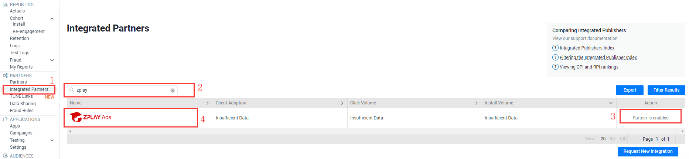
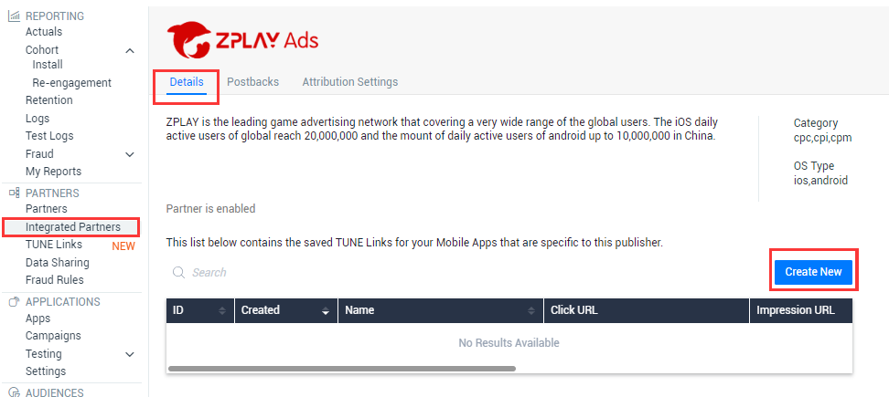
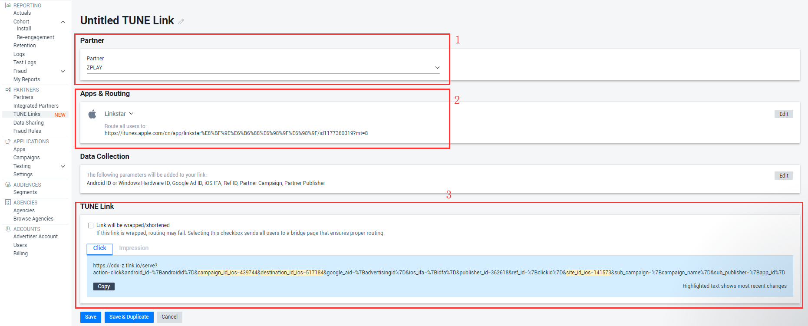
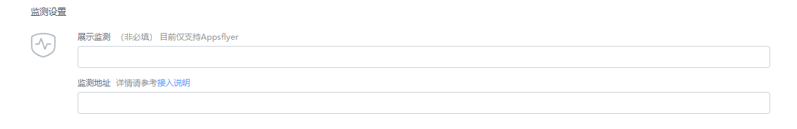

#### 1.	进入PARTNERS目录下Integrated Partners页面

#### 2.	在搜索框中输入ZPLAY进行搜索

#### 3.	将搜索到的ZPLAY Ads状态置为Partner is enabled  

#### 4.	点击ZPLAY Ads的logo进入ZPLAY Ads设置，选择“Create New”
 

#### 5.	在APP & Routing中选择您要推广的应用

#### 6.	您可以在TUNE Link中获取Click URL及Impression URL，点击“Save&Duplicate”复制并保存，见下图

#### 7.	在您创建广告或者编辑广告将获取到的URL填写到ZPLAY Ads的监测地址框内，

